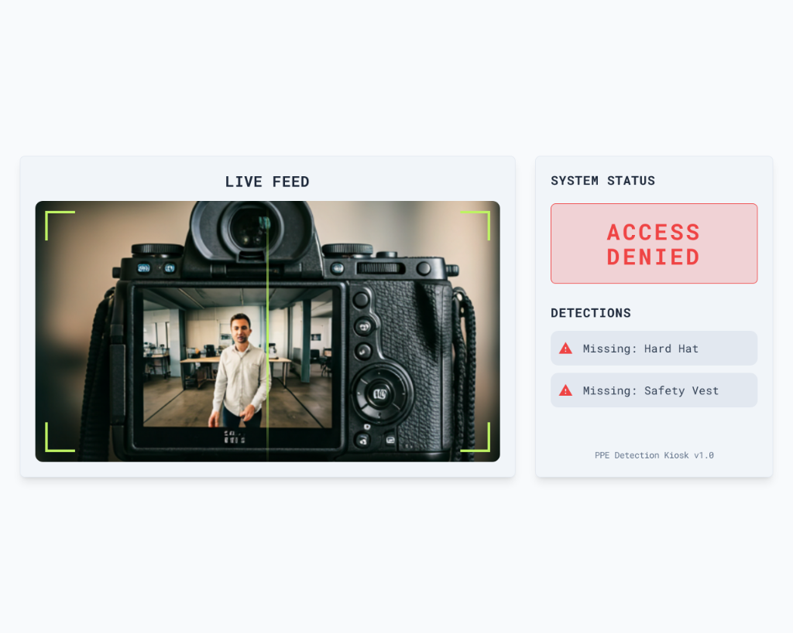

# PPE Detection Kiosk

A futuristic, AI-powered Personal Protective Equipment (PPE) detection system. This application uses a YOLOv8 backend to detect safety gear (Hard Hats, Safety Vests) in real-time and displays the status on a modern, cyberpunk-inspired dashboard.



## Features

-   **Real-time Detection:** Powered by YOLOv8 for instant feedback.
-   **Futuristic UI:** Tailwind CSS-based interface with scanning animations and dynamic status updates.
-   **Localhost Binding:** Securely binds to `127.0.0.1` for local deployment.
-   **Visual Feedback:** Clear "ACCESS GRANTED" (Green) or "ACCESS DENIED" (Red) indicators.

## Prerequisites

-   Python 3.8+
-   Node.js (optional, for advanced frontend dev, but not required for this vanilla setup)
-   Webcam

## Installation

1.  **Clone the repository:**
    ```bash
    git clone <your-repo-url>
    cd ppe
    ```

2.  **Install Backend Dependencies:**
    ```bash
    cd backend
    pip install -r requirements.txt
    cd ..
    ```
    *Ensure `ultralytics`, `fastapi`, `uvicorn`, `opencv-python`, and `pillow` are installed.*

## Usage

Start the application using the provided batch scripts (Windows):

1.  **Start the Backend:**
    Double-click `start_backend.bat`
    *Runs Uvicorn server on http://127.0.0.1:8000*

2.  **Start the Frontend:**
    Double-click `start_frontend.bat`
    *Host static files on http://127.0.0.1:5500*

3.  **Open the Kiosk:**
    The frontend script should provide the URL. Open `http://127.0.0.1:5500` in your browser.
    Allow camera permissions when prompted.

## Architecture

-   **Backend:** FastAPI (Python) serving a custom YOLOv8 model.
-   **Frontend:** Vanilla HTML5, JavaScript, and Tailwind CSS (via CDN).
-   **Communication:** Frontend sends webcam frames via POST request to `/detect`; Backend responds with JSON status and debug image.

## Customization

-   **UI Style:** Edit `frontend/index.html` to tweet Tailwind classes.
-   **Detection Logic:** Modify `backend/main.py` to adjust grace periods or violation rules.
